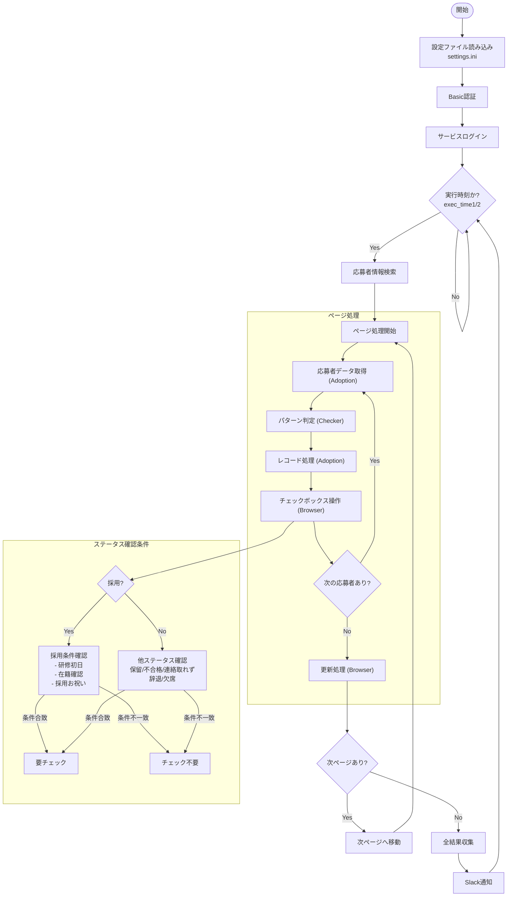

```mermaid
graph TD
    Start([開始]) --> ReadConfig[設定ファイル読み込み<br>settings.ini]
    ReadConfig --> Auth[Basic認証]
    Auth --> Login[サービスログイン]
    
    Login --> WaitTime{実行時刻か?<br>exec_time1/2}
    WaitTime -- No --> WaitTime
    WaitTime -- Yes --> SearchApplicants[応募者情報検索]
    
    SearchApplicants --> ProcessPage[ページ処理開始]
    
    subgraph ページ処理
        ProcessPage --> GetApplicantData["応募者データ取得 (Adoption)"]
        GetApplicantData --> CheckPattern["パターン判定 (Checker)"]
        CheckPattern --> ProcessRecord["レコード処理 (Adoption)"]
        ProcessRecord --> ClickCheckbox["チェックボックス操作 (Browser)"]
        ClickCheckbox --> HasMoreApplicants{次の応募者あり?}
        HasMoreApplicants -- Yes --> GetApplicantData
        HasMoreApplicants -- No --> UpdatePage["更新処理 (Browser)"]
    end
    
    UpdatePage --> CheckNextPage{次ページあり?}
    CheckNextPage -- Yes --> GoToNextPage[次ページへ移動]
    GoToNextPage --> ProcessPage
    
    CheckNextPage -- No --> CollectResults[全結果収集]
    CollectResults --> NotifySlack[Slack通知]
    NotifySlack --> WaitTime
    
    subgraph "ステータス確認条件"
        ClickCheckbox --> IsAdopted{採用?}
        IsAdopted -- Yes --> CheckAdoptCond["採用条件確認<br>- 研修初日<br>- 在籍確認<br>- 採用お祝い"]
        IsAdopted -- No --> CheckOtherStatus["他ステータス確認<br>保留/不合格/連絡取れず<br>辞退/欠席"]
        
        CheckAdoptCond -- 条件合致 --> NeedCheck[要チェック]
        CheckOtherStatus -- 条件合致 --> NeedCheck
        CheckAdoptCond -- 条件不一致 --> NoCheck[チェック不要]
        CheckOtherStatus -- 条件不一致 --> NoCheck[チェック不要]
    end 
```