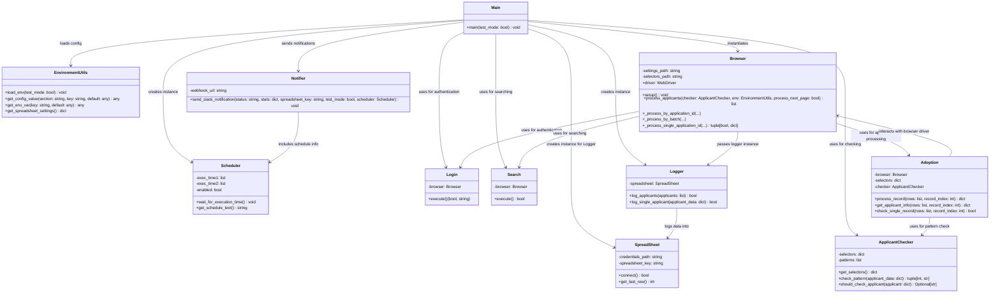

%% クラス図

```mermaid
classDiagram
    class EnvironmentUtils {
        +load_env(test_mode: bool) void
        +get_config_value(section: string, key: string, default: any) any
        +get_env_var(key: string, default: any) any
        +get_spreadsheet_settings() dict
    }

    class Scheduler {
        -exec_time1: list<int>
        -exec_time2: list<int>
        -enabled: bool
        +wait_for_execution_time() void
        +get_schedule_text() string
    }

    class SpreadSheet {
        -credentials_path: string
        -spreadsheet_key: string
        +connect() bool
        +get_last_row() int
    }

    class Browser {
        -settings_path: string
        -selectors_path: string
        +setup() void
        +driver: WebDriver
        +process_applicants(checker: ApplicantChecker, env: EnvironmentUtils, process_next_page: bool) list
        +_process_by_application_id(...)
        +_process_by_batch(...)
        +_process_single_application_id(...) tuple[bool, dict]
    }

    class Login {
        -browser: Browser
        +execute() (bool, string)
    }
    
    class Search {
        -browser: Browser
        +execute() bool
    }

    class ApplicantChecker {
        -selectors: dict
        -patterns: list
        +get_selectors() dict
        +check_pattern(applicant_data: dict) tuple[int, str]
        +should_check_applicant(applicant: dict) Optional[str]
    }
    
    class Adoption {
        -browser: Browser
        -selectors: dict
        -checker: ApplicantChecker
        +process_record(rows: list, record_index: int) dict
        +get_applicant_info(rows: list, record_index: int) dict
        +check_single_record(rows: list, record_index: int) bool
    }

    class Logger {
        -spreadsheet: SpreadSheet
        +log_applicants(applicants: list) bool
        +log_single_applicant(applicant_data: dict) bool
    }

    class Notifier {
        -webhook_url: string
        +send_slack_notification(status: string, stats: dict, spreadsheet_key: string, test_mode: bool, scheduler: Scheduler) void
    }

    class Main {
        +main(test_mode: bool) void
    }

    %% Relationships
    Main --> EnvironmentUtils : loads config
    Main --> Scheduler : creates instance
    Main --> SpreadSheet : creates instance for Logger
    Main --> Browser : instantiates
    Main --> Login : uses for authentication
    Main --> Search : uses for searching
    Main --> ApplicantChecker : uses for checking
    Main --> Logger : creates instance
    Main --> Notifier : sends notifications

    Browser --> Adoption : uses for applicant processing
    Browser --> Login : uses for authentication
    Browser --> Search : uses for searching
    Browser --> Logger : passes logger instance
    Adoption --> ApplicantChecker : uses for pattern check
    Adoption --> Browser : interacts with browser driver
    Logger --> SpreadSheet : logs data into
    Notifier --> Scheduler : includes schedule info 
```
