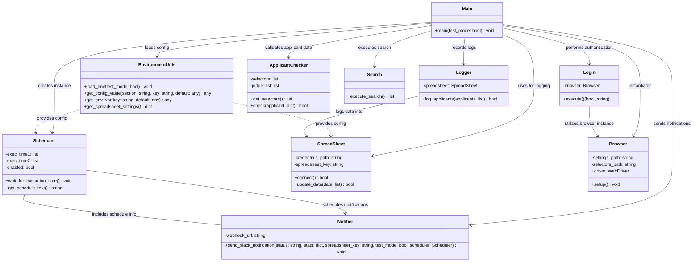

%% クラス図

```mermaid
classDiagram
    class EnvironmentUtils {
        +load_env(test_mode: bool) void
        +get_config_value(section: string, key: string, default: any) any
        +get_env_var(key: string, default: any) any
        +get_spreadsheet_settings() dict
    }

    class Scheduler {
        -exec_time1: list<int>
        -exec_time2: list<int>
        -enabled: bool
        +wait_for_execution_time() void
        +get_schedule_text() string
    }

    class SpreadSheet {
        -credentials_path: string
        -spreadsheet_key: string
        +connect() bool
        +update_data(data: list) bool
    }

    class Browser {
        -settings_path: string
        -selectors_path: string
        +setup() void
        +driver: WebDriver
    }

    class Login {
        -browser: Browser
        +execute() (bool, string)
    }

    class ApplicantChecker {
        -selectors: list
        -judge_list: list
        +get_selectors() list
        +check(applicant: dict) bool
    }

    class Search {
        +execute_search() list
    }

    class Logger {
        -spreadsheet: SpreadSheet
        +log_applicants(applicants: list) bool
    }

    class Notifier {
        -webhook_url: string
        +send_slack_notification(status: string, stats: dict, spreadsheet_key: string, test_mode: bool, scheduler: Scheduler) void
    }

    class Main {
        +main(test_mode: bool) void
    }

    %% Relationships
    Main --> EnvironmentUtils : loads config
    Main --> Scheduler : creates instance
    Main --> SpreadSheet : uses for logging
    Main --> Browser : instantiates
    Main --> Login : performs authentication
    Main --> ApplicantChecker : validates applicant data
    Main --> Search : executes search
    Main --> Logger : records logs
    Main --> Notifier : sends notifications

    EnvironmentUtils ..> Scheduler : provides config
    EnvironmentUtils ..> SpreadSheet : provides config
    Scheduler --> Notifier : schedules notifications
    Login --> Browser : utilizes browser instance
    Logger --> SpreadSheet : logs data into
    Notifier --> Scheduler : includes schedule info 
```
