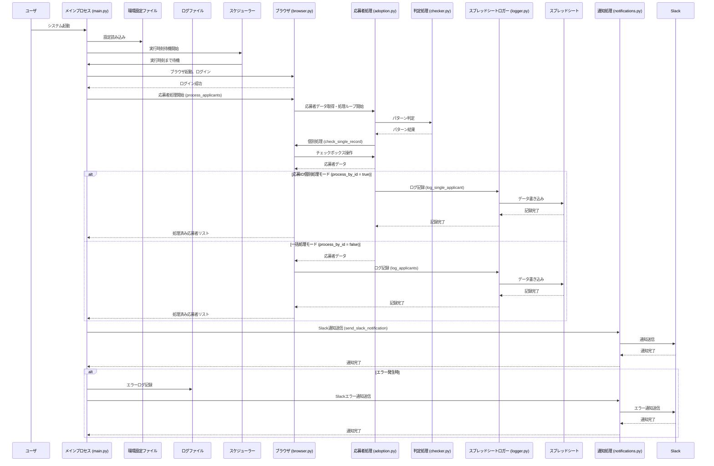

```mermaid
sequenceDiagram
    participant User as ユーザ
    participant Main as メインプロセス (main.py)
    participant Env as 環境設定ファイル
    participant Log as ログファイル
    participant Scheduler as スケジューラー
    participant Browser as ブラウザ (browser.py)
    participant Adoption as 応募者処理 (adoption.py)
    participant Checker as 判定処理 (checker.py)
    participant SheetLogger as スプレッドシートロガー (logger.py)
    participant Sheet as スプレッドシート
    participant Notifier as 通知処理 (notifications.py)
    participant Slack as Slack

    User->>Main: システム起動
    Main->>Env: 設定読み込み
    Main->>Scheduler: 実行時刻待機開始
    Scheduler->>Main: 実行時刻まで待機

    Main->>Browser: ブラウザ起動、ログイン
    Browser-->>Main: ログイン成功

    Main->>Browser: 応募者処理開始 (process_applicants)
    Browser->>Adoption: 応募者データ取得・処理ループ開始
    Adoption->>Checker: パターン判定
    Checker-->>Adoption: パターン結果
    Adoption->>Browser: 個別処理 (check_single_record)
    Browser->>Adoption: チェックボックス操作
    Adoption-->>Browser: 応募者データ

    alt 応募ID個別処理モード (process_by_id = true)
        Adoption->>SheetLogger: ログ記録 (log_single_applicant)
        SheetLogger->>Sheet: データ書き込み
        Sheet-->>SheetLogger: 記録完了
        SheetLogger-->>Adoption: 記録完了
        Browser-->>Main: 処理済み応募者リスト
    else 一括処理モード (process_by_id = false)
        Adoption-->>Browser: 応募者データ
        Browser->>SheetLogger: ログ記録 (log_applicants)
        SheetLogger->>Sheet: データ書き込み
        Sheet-->>SheetLogger: 記録完了
        SheetLogger-->>Browser: 記録完了
        Browser-->>Main: 処理済み応募者リスト
    end

    Main->>Notifier: Slack通知送信 (send_slack_notification)
    Notifier->>Slack: 通知送信
    Slack-->>Notifier: 通知完了
    Notifier-->>Main: 通知完了

    alt エラー発生時
        Main->>Log: エラーログ記録
        Main->>Notifier: Slackエラー通知送信
        Notifier->>Slack: エラー通知送信
        Slack-->>Notifier: 通知完了
        Notifier-->>Main: 通知完了
    end
```
```    