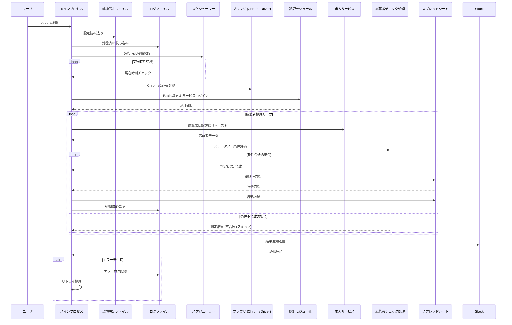

```mermaid
sequenceDiagram
    participant User as ユーザ
    participant Main as メインプロセス
    participant Env as 環境設定ファイル
    participant Log as ログファイル
    participant Scheduler as スケジューラー
    participant Browser as ブラウザ (ChromeDriver)
    participant Auth as 認証モジュール
    participant Service as 求人サービス
    participant Checker as 応募者チェック処理
    participant Sheet as スプレッドシート
    participant Slack as Slack

    User->>Main: システム起動
    Main->>Env: 設定読み込み
    Main->>Log: 処理済ID読み込み
    Main->>Scheduler: 実行時刻待機開始

    loop 実行時刻待機
        Scheduler->>Main: 現在時刻チェック
    end

    Main->>Browser: ChromeDriver起動
    Main->>Auth: Basic認証 & サービスログイン
    Auth-->>Main: 認証成功

    loop 応募者処理ループ
        Main->>Service: 応募者情報取得リクエスト
        Service-->>Main: 応募者データ
        Main->>Checker: ステータス・条件評価
        alt 条件合致の場合
            Checker-->>Main: 判定結果: 合致
            Main->>Sheet: 最終行取得
            Sheet-->>Main: 行数取得
            Main->>Sheet: 結果記録
            Main->>Log: 処理済ID追記
        else 条件不合致の場合
            Checker-->>Main: 判定結果: 不合致 (スキップ)
        end
    end

    Main->>Slack: 結果通知送信
    Slack-->>Main: 通知完了

    alt エラー発生時
        Main->>Log: エラーログ記録
        Main->>Main: リトライ処理
    end
```
```    