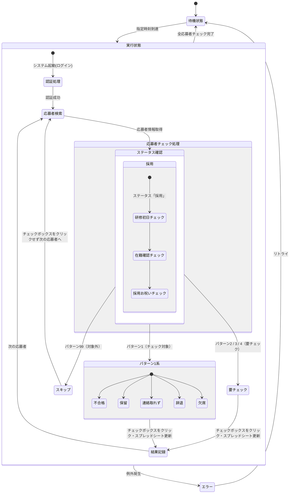

# 求人応募者ステータス確認自動化システム仕様書

## 1. システム概要

本システムは、求人サービスの応募者ステータスを定期的にチェックし、  
結果をログシート（Google Spreadsheet）へ出力・Slackへ通知する仕組みを提供します。

### 1.1 主要機能

1. **スケジューリング実行**  
   指定した時刻（複数可）に自動的に処理を開始します。  
   - [SCHEDULE]セクションにより、有効/無効・時刻設定を行います。  
   - スケジューラー停止時は、起動即時で処理を実行します。

2. **ブラウザ操作（Selenium）**  
   ヘッドレスモード対応とし、検索条件入力やステータス取得を自動化します。

3. **応募者情報のチェック**  
   - 設定された各パターン（1〜4、99）に合致する応募者の詳細情報を取得し、必要なフラグを判定します。  
   - 判定ロジックは `checker.py` で行います。
   - パターン1〜4は常にチェック対象となり、チェックボックスがクリックされます。
   - **パターン99は`include_pattern_99`設定に応じて処理対象になります**：
     - `include_pattern_99 = true`: パターン99もチェック対象となり、チェックボックスがクリックされます
     - `include_pattern_99 = false`: パターン99はスキップされ、チェックボックスがクリックされません

4. **スプレッドシートへの記録**  
   - 取得結果を「ログシート」に書き込みます。  
   - 書き込み時に不要（パターン99など）があればフィルタリングして出力対象を調整します。
   - **パターン99の記録は `[LOGGING] include_pattern_99` 設定で制御されます**：
     - `include_pattern_99 = true`: パターン99もスプレッドシートに記録されます
     - `include_pattern_99 = false`: パターン99はスプレッドシートに記録されません

5. **Slack通知**  
   - 結果サマリ（統計情報、各パターン件数）をBlock Kit形式で通知します。  
   - 通知にはキー情報（提出ステータスや期限、スケジュール時刻など）を含むフッターを自動で付します。  
   - エラー発生時はエラーメッセージを添えて通知します。

6. **テストモード**  
   - `--test` オプション付与で実行すると、一部設定値を切り替えてテスト用の動作を行います。  
   - Slack通知時に `[テストモード]` と表示されます。

---

## 2. システム構成

### 2.1 ディレクトリ構造
```
project_root/
├── src/
│   ├── main.py                 # メインスクリプト(エントリーポイント)
│   ├── modules/
│   │   ├── browser.py          # Selenium/ブラウザ操作
│   │   ├── checker.py          # 応募者情報のチェック判定
│   │   ├── login.py            # ログイン処理
│   │   ├── logger.py           # スプレッドシートへのログ記録
│   │   ├── scheduler.py        # スケジューリング実行
│   │   ├── search.py           # 検索処理
│   │   ├── adoption.py         # 応募者データ処理
│   │   └── spreadsheet.py      # スプレッドシート操作
│   └── utils/
│       ├── environment.py      # 環境設定（settings.ini 等）
│       ├── notifications.py    # Slack通知処理
│       ├── logging_config.py   # ログ設定
│       ├── helpers.py          # ヘルパー関数
│       ├── retry_decorator.py  # リトライデコレータ
│       └── path_generator.py   # パス生成ユーティリティ
├── config/
│   ├── settings.ini            # システム設定(エンドユーザ設定想定)
│   ├── selectors.csv           # 要素セレクタ定義
│   ├── judge_list.csv          # 判定条件定義
│   └── data.json               # Google API認証
├── logs/                       # ログファイル格納先
│   └── app_YYYYMMDD.log
├── tests/                      # テストコード
│   ├── __init__.py
│   ├── conftest.py
│   ├── test_browser.py
│   └── test_spreadsheet.py
├── docs/                       # ドキュメント
│   ├── spec.md                 # 仕様書 (本ファイル)
│   ├── system.md               # システム構成図
│   ├── data_flow.md            # データフロー図
│   ├── class_diagram.md        # クラス図
│   ├── sequence.md             # シーケンス図
│   ├── activity.md             # アクティビティ図
│   └── state.md                # 状態遷移図
├── requirements.txt            # Python依存パッケージ記載
├── run.bat                     # 実行バッチファイル
├── run_dev.bat                 # 開発用実行バッチファイル
├── README.md                   # プロジェクト説明
└── .gitignore                  # Git除外設定
```

### 2.2 外部連携
- Google Spreadsheet: 結果出力先
- Slack: 通知送信先
- 求人サービス: データ取得元

### 2.3 インポート構造
**システムでは絶対インポートを使用しています**：
- `from src.modules.browser import Browser`
- `from src.utils.environment import EnvironmentUtils`
- 相対インポート（`from ..modules` 等）は使用していません

### 2.4 設定ファイル (settings.ini)
```ini
[SERVICE]
domain = www.juku.st
service_account_file = config/data.json

[SCHEDULE]
# 有効(true)/無効(false)
enabled = true
# 1回目実行時刻 (HH:MM形式)
exec_time1 = 12:00
# 2回目実行時刻 (HH:MM形式)
exec_time2 = 18:00

[BROWSER]
# ヘッドレスモード有効(true)/無効(false)
headless = true
# 自動更新ボタンをクリックする
auto_update = true
# 検索結果が0件になるまで繰り返し処理
repeat_until_empty = true

[LOGGING]
# パターン99(対象外)をログや通知で含めるか
# true: パターン99も処理対象・記録対象になる
# false: パターン99はスキップされ、記録されない
include_pattern_99 = true

[SEARCH]
# 提出ステータス (未提出/提出中/提出済など)
submit_status = 2
# 提出期限 (""=指定なし, 1=今月末, 2=期限超過)
submit_deadline = ""

[SPREADSHEET]
# スプレッドシートキー
spreadsheet_key = your_spreadsheet_key
# 認証情報ファイルパス
credentials_path = config/data.json
# シート名
sheet_name = exe_logsheet

[log_settings]
# ログサイズを一定量でローテーションし、古いファイルをバックアップ
max_file_size_mb = 10
backup_count = 30
max_age_days = 90
max_total_size_mb = 1000
log_dir = logs
```

### 2.2 モジュール/ファイル詳細

| ファイル                | 概要                                                                             |
| ----------------------- | -------------------------------------------------------------------------------- |
| **main.py**             | エントリーポイント。初期設定やスケジューラー実行、メインフローを制御します。       |
| **browser.py**          | Seleniumによるブラウザ操作を包括。ヘッドレスモード設定や要素探索機能を提供。      |
| **checker.py**          | 応募者情報に対するパターン判定処理を中心に実装。                                 |
| **login.py**            | ログインプロセス全般（接続先のURL、認証情報の入力、成功判定など）。               |
| **logger.py**           | スプレッドシートへの書き込みをラップ。パターン99の制御など。                      |
| **scheduler.py**        | 指定時刻まで待機する機能。スケジュール情報を文字列化して通知などに利用。           |
| **search.py**           | 検索条件のセットや検索ボタンクリックなど、一連の検索処理ロジックを提供。          |
| **spreadsheet.py**      | Google Spreadsheet APIを使ったデータの読み書き処理。                              |
| **environment.py**      | 設定ファイル(`settings.ini`など)や環境変数からの値読込、プロジェクトパス管理。     |
| **notifications.py**    | Slack Block Kit形式とした通知のペイロード生成。SlackへのPOST機能。                |
| **logging_config.py**   | ログのレベル、フォーマット設定、ローテーションポリシーなど。                      |
| **selectors.csv**       | 各ページ要素のセレクタ設定(XPATH/CSS)。                                           |
| **judge_list.csv**      | ステータス判定や採用可否フラグなどをパターンごとに定義。                                |
| **settings.ini**        | 本システムの主要設定ファイル(スケジューラー有効/無効、実行時刻など)。             |

---

## 3. 機能仕様

### 3.1 基本フロー
1. Basic認証によるアクセス
2. サービスへのログイン
3. 指定時刻での実行待機
4. 応募者情報の検索
5. 応募者情報の確認・チェック
   - 採用ステータスの確認
   - 研修初日の確認
   - 在籍確認状況の確認
   - 採用お祝いの確認
   - 管理者メモ(admin_memo)の確認
   - パターン判定理由(pattern_reason)の確認（ボタン要素）
   - 備考欄(memo)の確認（ボタン要素）
6. **パターン判定に基づく処理対象の決定**：
   - パターン1〜4: 常に処理対象
   - パターン99: `include_pattern_99`設定に応じて処理対象を決定
7. 結果の記録（スプレッドシート）
8. 結果の通知（Slack）

### 3.2 チェック条件
以下の条件に合致する応募者を自動チェック:

1. 採用確定ケース:
   - 共通条件:
     - ステータスが「採用」
     - 採用お祝い未送信（空白）
     - 管理者メモ(admin_memo)未記入（空白）

   パターン別条件:
   a. パターン2: 研修日未定
     - 研修初日が「未定」
     - 在籍確認が未実施

   b. パターン3: 研修日確定（実行月以降）
     - 研修初日が設定済み（未定でない）
     - 研修初日が実行月以降
     - 在籍確認が未実施

   c. パターン4: 研修開始1ヶ月経過
     - 研修初日が設定済み（未定でない）
     - 研修初日から1ヶ月以上経過
     - 在籍確認が済（〇）

2. 不採用等確定ケース（パターン1）:
   - ステータスが以下のいずれか:
     - 「保留」
     - 「不合格」
     - 「連絡取れず」
     - 「辞退」
     - 「欠席」
   - 採用お祝い未送信（空白）
   - 管理者メモ(admin_memo)未記入（空白）

3. **対象外ケース（パターン99）**:
   - 上記パターン1〜4の条件に該当しない
   - **処理対象は`include_pattern_99`設定により決定**:
     - `include_pattern_99 = true`: チェックボックスがクリックされ、スプレッドシートに記録される
     - `include_pattern_99 = false`: スキップされ、チェックボックスがクリックされない

### 3.3 処理対象判定ロジック（browser.py）
```python
# パターン1〜4は常に処理対象
# パターン99は設定に応じて処理対象を決定
include_pattern_99 = env.get_config_value('LOGGING', 'include_pattern_99', False)
should_check = (1 <= pattern <= 4) or (pattern == 99 and include_pattern_99)
```

### 3.3 設定項目
| 項目 | 説明 | 形式 |
|------|------|------|
| domain | サービスドメイン | 文字列（例：stgc.juku.st） |
| SpreadSheetKey | スプレッドシートID | 文字列 |
| webhook | Slack Webhook URL | URL文字列 |
| BasicId | Basic認証ID | 文字列 |
| BasicP | Basic認証パスワード | 文字列 |
| LoginId | サービスログインID | 文字列 |
| LoginPw | サービスログインパスワード | 文字列 |
| exec_time1 | 1回目実行時刻 | HH:MM形式 |
| exec_time2 | 2回目実行時刻 | HH:MM形式 |
| TEST | 提出期限指定 | boolean |

## 4. 技術仕様

### 4.1 使用技術
- Python 3.x
- Selenium WebDriver
- ChromeDriver
- gspread (Google Spreadsheet API)
- requests (Slack通知)

### 4.2 エラー処理
1. ネットワークエラー
   - 接続エラー時は10秒待機後リトライ
   - 3回リトライ後も失敗時はシステム停止

2. スプレッドシート更新エラー
   - 更新失敗時は10秒待機後1回リトライ
   - リトライ失敗時はエラーログを出力

### 4.3 セキュリティ
- Basic認証による保護
- 設定ファイルでの認証情報管理
- ChromeDriverのセキュリティ警告対応

## 5. 運用・保守

### 5.1 動作環境要件
- Windows OS
- Chrome ブラウザ
- 安定したインターネット接続
- スリープ設定の無効化

### 5.2 運用上の注意事項
1. システム稼働中の禁止事項:
   - システムコンソールの操作
   - 使用中のブラウザの操作
   - 設定ファイルの変更

2. 設定ファイル（setting.txt）の編集:
   - "="以降の値のみ変更可能
   - 空白・改行の追加禁止
   - 形式を厳密に守る必要あり

## 6. サポート体制
- 不具合報告: ココナラDM
- 技術サポート: 開発者への直接連絡 


### 3.2 セレクター (selectors.csv)
- ページ要素の検索用キーをID/クラス/パスなどで定義。
- 例：  
  ```docs/spec.md
  [login_page]
  username_field, #username
  password_field, #password
  submit_button, //button[@id='login']
  ```

### 3.3 判定条件 (judge_list.csv)
- ステータス判定や採用可否フラグなどをパターンごとに定義。
- 例：  
  ```
  pattern,description
  1,不合格または連絡取れずのケース
  2,採用決定だが研修日程未定
  3,研修日程が確定済み …  
  ```

---

## 4. 処理フロー

1. **起動/初期化**  
   - `main.py` 実行時、引数 `--test` の有無でモード判定。  
   - `environment.py` が `settings.ini` 読み取り。

2. **スケジューラー**  
   - `[SCHEDULE] enabled=true` の場合、指定時刻が来るまで `wait_for_execution_time()` でループ。  
   - スケジュール無効の場合はすぐ次の処理へ進む。

3. **ブラウザ設定**  
   - `headless=true` でChromeドライバはバックグラウンド実行。  
   - `auto_update=true` の場合、一部のシーンで自動更新クリックを行う。

4. **ログイン/検索処理**  
   - `login.py` で認証情報入力 → 成功判定。  
   - `search.py` で検索条件(`submit_status` など)を設定 → 実行 → 結果一覧を取得。

5. **判定/チェック/更新処理**  
   - 以下の処理を繰り返す：
     a. 現在のページの応募者データを処理
       - `checker.py` が取得したデータをパターン別に判定
       - 条件に合致する応募者のチェックボックスをクリック
       - 変更があった場合は更新ボタンをクリック
       - **変更がなくなるまで同じページで検索を再実行して処理を繰り返す**
     b. 現在のページで処理対象がなくなったら次のページに移動
     c. 次ページボタンがクリックできなくなったら処理終了

6. **スプレッドシート更新**  
   - `spreadsheet.py` と連携して書き込み。  
   - `logger.py` がデータ整形し、パターン99のフィルタリングを実施。
   - `[LOGGING] include_pattern_99=false` であればパターン99を除外。

7. **Slack通知**  
   - `notifications.py` でBlock Kit形式のメッセージを作成。  
   - 処理件数/パターン別件数/ログシートURL/フッターを添付。  
   - 成功・失敗いずれも通知可。  
   - テストモード時はヘッダー文言に `[テストモード]` を付与。

8. **終了/後処理**  
   - ブラウザを閉じる。  
   - 例外発生時は `send_slack_notification` でエラーを通知しつつ終了。

---

## 5. 処理フロー詳細

### 5.1 更新処理の挙動

更新処理は `settings.ini` の `auto_update` 設定によって挙動が変わります：

#### auto_update = true の場合（本番運用時）
1. チェックボックスをクリックした応募者がある場合、更新ボタンをクリック
2. 更新確定ボタンをクリック
3. 完了後、閉じるボタンをクリック
4. 同じページを再検索し、チェック対象のレコードがなくなるまで繰り返す
5. チェック対象のレコードがなくなったら、次のページに進む
6. 次のページがなくなったら処理を終了

#### auto_update = false の場合（テスト・確認時）
1. チェックボックスをクリックした応募者がある場合、更新ボタンをクリック
2. 更新キャンセルボタンをクリック
3. ページが切り替わらないため、検索ボタンをクリックして同じページを再表示
4. チェック対象のレコードがなくなるまで繰り返す
5. チェック対象のレコードがなくなったら、次のページに進む
6. 次のページがなくなったら処理を終了

---

## 6. チェックロジック概要

「checker.py」における主なパターン分類例：

1. **パターン1（不合格系など）**  
   - ステータスが「保留」「不合格」「辞退」「連絡取れず」「欠席」といった判定。  
   - 採用お祝い未送信、管理者メモが空の場合。

2. **パターン2（採用確定・研修日未定）**  
   - ステータス「採用」。  
   - 研修初日が「未定」、在籍確認未実施。

3. **パターン3（研修日確定、実行月以降）**  
   - ステータス「採用」。  
   - 日付決定済だが当月以降。  
   - 在籍確認が未実施。

4. **パターン4（研修開始1か月経過）**  
   - ステータス「採用」。  
   - 研修日から1ヶ月以上が経過しており、在籍確認が済み。

5. **パターン99（対象外）**  
   - 上記条件に該当しない。  
   - **処理・記録は設定により制御**：
     - `include_pattern_99 = true`: チェック対象となり、スプレッドシートに記録される
     - `include_pattern_99 = false`: スキップされ、出力/通知から除外される

---

## 7. テストモード

1. `--test` オプション
   - `settings.ini` の一部設定を上書き可能（モード切替用）。  
   - Slack通知メッセージの冒頭に `[テストモード]` が付与。  
   - 実行時刻などをテスト用に短縮するケース。

2. テスト用スプレッドシート
   - 別キーを利用。  
   - 本番シートを汚さない。

3. ログ出力
   - ログファイルには「テストモード」と追記。

---

## 8. エラー処理

1. **ネットワークエラー**  
   - 接続失敗時に10秒刻みで最大3回リトライ。  
   - 失敗時はエラーログ＆Slackに通知→システム停止。

2. **Seleniumエラー**  
   - 要素が見つからない場合20秒程度の待機を挟んでリトライすることあり。  
   - それでも失敗したらエラーとして通知。

3. **シート書き込みエラー**  
   - 1回リトライ。  
   - 失敗時はエラーログ＆通知。

---

## 9. ログ管理

1. **アプリケーションログ**  
   - Python標準logging＋`logging_config.py` で設定。  
   - 日次or容量ローテーションを実施。  
   - エラーのスタックトレースを保存。

2. **スプレッドシートログ**  
   - `logger.py` で応募者単位の詳細を記録。  
   - パターン99の扱いは設定次第。  
   - 処理日付、担当、コメントなどを記録可能。

3. **Slack通知ログ**  
   - Slackに送った通知はhistoryに残さない（受信先チャンネルで管理）。

---

## 10. 運用・保守

1. **定期メンテナンス**  
   - logsフォルダクリア、古いログの削除。  
   - ChromeDriverやSeleniumのバージョン更新。  
   - credentialsの期限切れチェック。

2. **トラブルシューティング**  
   - Slackに通知されるエラー内容を確認。  
   - ログのスタックトレースで原因特定。  
   - ネットワークやセレクター定義の変更有無を確認。

3. **バックアップ**  
   - config/ と logs/ のバックアップ。  
   - Google Spreadsheetのバックアップ。

---

## 11. セキュリティ

1. **認証情報の保管**  
   - `data.json` のGoogle認証情報はGit管理外にするのが望ましい。  
   - Slack Webhook URLも環境変数など安全な保管方法を推奨。

2. **HTTPS**  
   - 基本的にすべての通信をHTTPS経由。  
   - サイトのBasic認証が別途ある場合、`login.py` で対応。

3. **機密データ保護**  
   - 検索結果の応募者個人情報取り扱いに注意。  
   - データ漏洩防止策（暗号化、アクセス制限など）を検討。

---

## 12. 開発・テスト

1. **開発環境要件**  
   - Python >= 3.8  
   - インストールパッケージを `requirements.txt` で管理  
   - テストでChromeのドライバを使用

2. **単体テスト**  
   - `tests/` ディレクトリにPythonのunittestまたはpytestを配置。  
   - browser.py, checker.py, logger.py など主要モジュールごとにテスト。

3. **結合テスト**  
   - ログイン〜検索〜判定〜通知の一連の流れをテストする。  
   - テストモードを利用し、実行時刻を近い未来に設定して正常動作を確認。

4. **リリース手順**  
   - ソースコード確定後、`pyinstaller` 等でexe化する場合あり。  
   - config/settings.ini をユーザに応じて作成。

---

**© 2023 システム開発者一同**  
本システム仕様書の内容は今後予告なく変更されることがあります。

