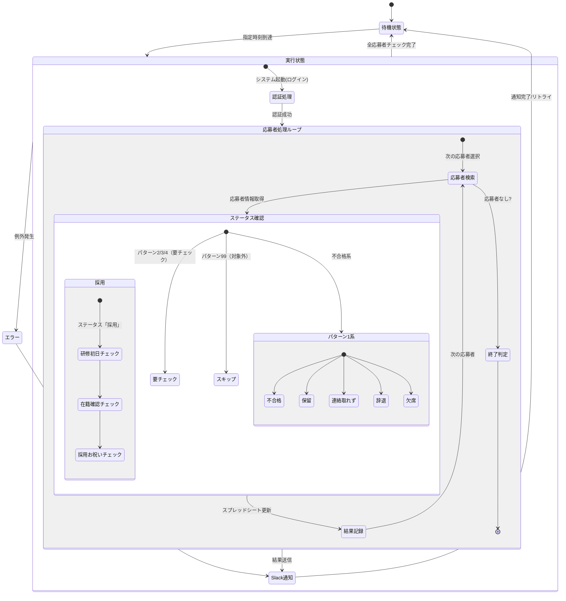

```mermaid
stateDiagram-v2
    [*] --> 待機状態
    待機状態 --> 実行状態: 指定時刻到達

    state 実行状態 {
        [*] --> 認証処理: システム起動(ログイン)
        認証処理 --> 応募者処理ループ: 認証成功

        state 応募者処理ループ {
            [*] --> 応募者検索: 次の応募者選択
            応募者検索 --> ステータス確認: 応募者情報取得

            state ステータス確認 {
                state 採用 {
                    [*] --> 研修初日チェック: ステータス「採用」
                    研修初日チェック --> 在籍確認チェック
                    在籍確認チェック --> 採用お祝いチェック
                }
                state パターン1系 {
                    [*] --> 不合格
                    [*] --> 保留
                    [*] --> 連絡取れず
                    [*] --> 辞退
                    [*] --> 欠席
                }
                [*] --> 要チェック: パターン2/3/4（要チェック）
                [*] --> スキップ: パターン99（対象外）
                [*] --> パターン1系: 不合格系
            }
            ステータス確認 --> 結果記録: スプレッドシート更新
            結果記録 --> 応募者検索: 次の応募者
            応募者検索 --> 終了判定: 応募者なし?
            終了判定 --> [*]
        }

        応募者処理ループ --> Slack通知: 結果送信
    }

    実行状態 --> 待機状態: 全応募者チェック完了
    実行状態 --> エラー: 例外発生
    エラー --> Slack通知: エラー通知
    Slack通知 --> 待機状態: 通知完了/リトライ
```