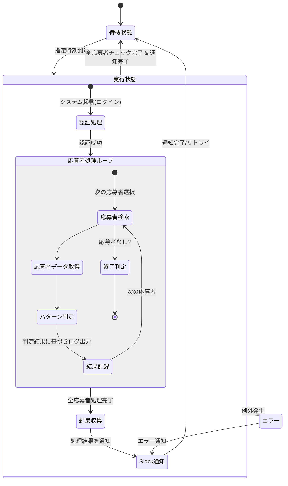

```mermaid
stateDiagram-v2
    [*] --> 待機状態
    待機状態 --> 実行状態: 指定時刻到達

    state 実行状態 {
        [*] --> 認証処理: システム起動(ログイン)
        認証処理 --> 応募者処理ループ: 認証成功

        state 応募者処理ループ {
            [*] --> 応募者検索: 次の応募者選択
            応募者検索 --> 応募者データ取得
            応募者データ取得 --> パターン判定
            パターン判定 --> 結果記録: 判定結果に基づきログ出力
            結果記録 --> 応募者検索: 次の応募者
            応募者検索 --> 終了判定: 応募者なし?
            終了判定 --> [*]
        }

        応募者処理ループ --> 結果収集: 全応募者処理完了
        結果収集 --> Slack通知: 処理結果を通知
    }

    実行状態 --> 待機状態: 全応募者チェック完了 & 通知完了
    実行状態 --> エラー: 例外発生
    エラー --> Slack通知: エラー通知
    Slack通知 --> 待機状態: 通知完了/リトライ
```