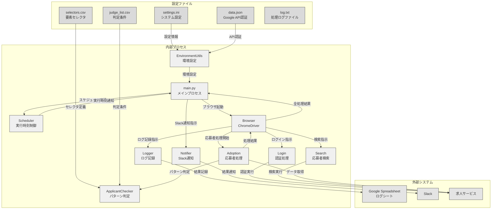

```mermaid
graph TB
    %% 外部システム
    subgraph "外部システム"
        GS[Google Spreadsheet<br/>ログシート]
        Slack[Slack]
        JOB[求人サービス]
    end

    %% 設定ファイル
    subgraph "設定ファイル"
        SET[settings.ini<br/>システム設定]
        JSON[data.json<br/>Google API認証]
        SEL[selectors.csv<br/>要素セレクタ]
        JUD[judge_list.csv<br/>判定条件]
        LOG[log.txt<br/>処理ログファイル]
    end

    %% 内部プロセス
    subgraph "内部プロセス"
        MAIN[main.py<br/>メインプロセス]
        ENV[EnvironmentUtils<br/>環境設定]
        SCHED[Scheduler<br/>実行時刻制御]
        BROW[Browser<br/>ChromeDriver]
        ADOPT[Adoption<br/>応募者処理]
        LOGIN[Login<br/>認証処理]
        SEARCH[Search<br/>応募者検索]
        CHK[ApplicantChecker<br/>パターン判定]
        LOGGER[Logger<br/>ログ記録]
        NOTIF[Notifier<br/>Slack通知]
    end

    %% 設定読み込み
    SET -->|設定情報| ENV
    ENV -->|環境設定| MAIN
    JSON -->|API認証| ENV
    SEL -->|セレクタ定義| CHK
    JUD -->|判定条件| CHK

    %% メインフロー制御
    MAIN -->|スケジュール確認| SCHED
    SCHED -->|実行時刻通知| MAIN

    %% ブラウザ操作
    MAIN -->|ブラウザ起動| BROW
    BROW -->|ログイン指示| LOGIN
    LOGIN -->|認証実行| JOB
    BROW -->|検索指示| SEARCH
    SEARCH -->|検索実行| JOB

    %% データ処理
    BROW -->|応募者処理開始| ADOPT
    ADOPT -->|データ取得| JOB
    ADOPT -->|パターン判定| CHK
    ADOPT -->|処理結果| BROW
    BROW -->|全処理結果| MAIN

    %% 結果記録・通知
    BROW -->|ログ記録指示| LOGGER
    LOGGER -->|結果記録| GS
    MAIN -->|Slack通知指示| NOTIF
    NOTIF -->|結果通知| Slack

    %% スタイル設定
    classDef default fill:#f4f4f4,stroke:#333,stroke-width:1px
    classDef external fill:#e4e4e4,stroke:#333,stroke-width:1px
    classDef config fill:#dadada,stroke:#333,stroke-width:1px
    classDef process fill:#f0f0f0,stroke:#333,stroke-width:1px

    class GS,Slack,JOB external
    class SET,JSON,SEL,JUD,LOG config
    class MAIN,ENV,SCHED,BROW,ADOPT,LOGIN,SEARCH,CHK,LOGGER,NOTIF process
```